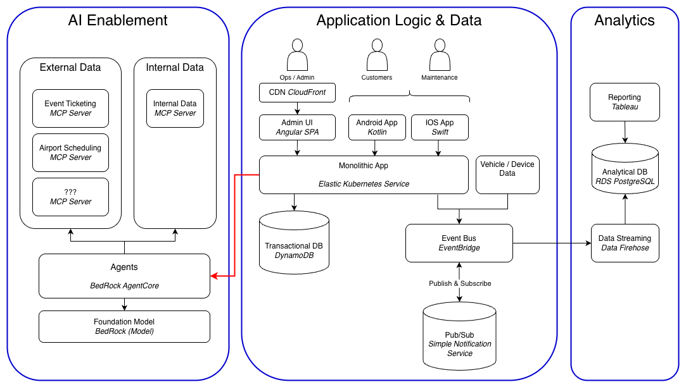

# O'Reilly Architectural Katas Q4 2025: AI Enabled Architecture

## Hermes System Architecture

## Team
**Name:** Weyland-Yutani Algorithm Recovery Squad
- [Robert Patton](https://www.linkedin.com/in/rpatton/) (FA Solutions, Lead Architect)
- [Mark Pineda](https://www.linkedin.com/in/mark-pineda-b62b98b/) (FA Solutions, Sr. Software Engineer)
- [Michael Vaughan](https://www.linkedin.com/in/michael-vaughan-5a33618/) (FA Solutions, DevOps Engineer)
- [Benjamin Warncke](https://www.linkedin.com/in/benjaminwarncke/) (Mutual of Enumclaw Insurance, Sr. Software Engineer)

[Link to this Submission Repository](https://github.com/bwarncke/architectural-katas-q4-2025-ai-enabled-architecture)

## Background
The **MobilityCorp** company provides short term rentals for last mile transport, 
offering a selection of electric scooters, bikes, cars and vans which 
are paid for by the minute. MobilityCorp has been in operation through Europe
but has not seen the usage and market growth desired, leading to an effort
to build new systems in support of that growth. A specific goal of the new
architecture is to safely use artificial intelligence to enhance the services
and address customer complaints with the existing offering. A brief outline of
the service offerings is followed by the feedback from customers.

### Key Elements of the Service Offerings
- This is a service for renting vehicles, much like other companies in the space with one slight difference in that scooters and bikes are available as well as cars. This combines what are typically services from different companies.
- There is an emphasis on enabling a better experience for the customer as well as better efficiency for MobilityCorp via systems intelligence. While this is likely true of every company, for us the company seems to be funded for and desire a complete rebuild and new approach.
- Customers are billed by the minute for any rental. All rentals have an associated timeline, for cars and vans it is the agreed upon rental period, for scooters and bikes it is a max rental period of 12 hours. 
- Rentals must be returned to designated locations. Any vehicle which is not returned to such a location by the end of the rental period or max duration are considered to be late and will incur additional fees above the per minute cost.
- Any issues with the rental vehicle will be corrected by MobilityCorp in various ways depending on the severity.

### Customer Complaints to Address
- **C1:** Vehicles are not where they are supposed to be at pickup
- **C2:** Vehicles are dirty or need maintenance when they are picked up for use by customers
- **C3:** Vehicles are not fully charged at pickup
- **C4:** Customers are not relying on the service for regular travel

### Elements Targeted for Greater Efficiency
- **E1:** Reduce the time from vehicle return to vehicle available for rental
- **E2:** Improve inventory balancing, for example accounting for greater demand in certain areas at certain times
- **E3:** Improve occupancy rate for the fleet
- **E4:** Decrease the percentage of the fleet incurring late fees and not returning vehicles to designated locations

### Architecture Challenges
In most respects the system(s) for MobilityCorp will be like any other modern system. Browser and native mobile apps, 
OLTP and OLAP data stores, event-driven architecture where possible, cloud / infrastructure as a service etc.
There are a few areas where extra care is needed and this must be addressed in the architecture:
- **A1:** Respect customer privacy with our vehicle and usage tracking
- **A2:** Expect instability in the AI tech space
- **A3:** How will we validate the results of logic using AI?

## Overview of the Hermes Systems Architecture
The new system, "*Hermes*", has the critical technology components depicted in the [diagram](#diagram-of-the-hermes-top-level-architecture) below. Where applicable we have shown
both a component name or tag as well as a technology we intend to use to support the element. Decisions which seem
like they may be debatable are covered in the following section for [Architecture Decision Records](#architecture-decision-records). The
architecture has 3 key areas: Application, Analytics and AI. These are described below and build on each other to 
some degree. Vehicle and [device technology](#key-elements-of-the-device-communications-architecture) is covered in a later section.

The architecture relies upon running in the AWS public cloud ([ADR](adr/ADR-Cloud.md)). Starting in the Application Logic and Data boundary we have a browser-based UI for internal use by operations 
and administrators and native mobile apps for customers and mobile support team on both Android and iOS. These UIs call into the business logic 
and processes running in a monolithic application deployed on the [Elastic Kubernetes Service](https://aws.amazon.com/pm/eks/). Transactional data is stored in a NoSQL DB 
provided by the [DynamoDB](https://aws.amazon.com/dynamodb) service. 

The monolithic application logic emits events to an event bus hosted in the [EventBridge](https://aws.amazon.com/eventbridge/) service, which uses pub/sub
topics to make the events available to subscribers. Device data from the vehicles and mobile apps is also sent through
EventBridge. Logic which is asynchronous in nature or not user-triggered directly is orchestrated by EventBridge in the 
pattern of Event X takes place, logic X and Z needs to be triggered. EventBridge receives event X, then makes calls
X and Z to endpoints in the application code. 

Some important points about the application architecture: REST is used for UI-facing endpoints, while gRPC is used for internal and 
event processing logic to call into the application. [Istio](https://istio.io/) is <ins>tentatively</ins> selected for the service mesh, pending evaluation.

The analytics environment is important to include at this level because it is crucial to understanding what is working 
and not working in terms of addressing customer complaints to drive market growth. It is also an important data source 
for the AI-enabled decisions which make up the third element of the architecture. A star schema will be modeled in 
conjunction with the application's relational schema, and will reside in PostgreSQL (until growth warrants a change to
a higher cost solution such as RedShift or SnowFlake). The data pipelines to get into the analytics store are handled 
primarily by a handoff from EventBridge to [Data Firehose](https://aws.amazon.com/firehose/) and Firehose triggering 
data loads (very small ones, this is event-based primarily) into the analytics store. Tableau is to be used for
reporting and visualization, this is one of the areas we feel it worth it to invest in a more expensive product.

The architecture for AI usage is highly dependent on AWS services. BedRock AgentCore is to be used to host and manage 
the actual agents, while MCP servers are heavily used for access to key data sources. The most important
element of this area is the agents in BedRock. These agents are using foundation models as well as data via 
MCP servers (some of which may be forward-looking, this needs further research) to make decisions about strategic questions like
the current pricing to use for a given vehicle type and area, how to manage and balance inventory across hub areas
in order to meet demand and increase the occupancy rate, to tactical work such as evaluating damage and cleanup needed 
for the individual vehicles.

### Diagram of the Hermes Top-Level Architecture

## Key Elements of the Device Communications Architecture
* The cellular network will be used to transmit all communications from the vehicle back to the Hermes systems, this transmission capability will be added in to the fleet's vehicles
* LTE-FDD bands 7 and 28 will be used for the broadest coverage possible 
* All vehicles have GPS receivers built in and location data will be transmitted home
* GPS is unidirectional, the cell signal is required in order to receive data and in the event that there is no signal the onboard cellular transmission device will record and store location data to be transmitted once signal resumes. 
* Any vehicle which remains out of signal range for a configurable amount of time will be flagged for review with the intent to build data around areas with consistent lack of  service and determine whether such areas should be permitted
* All diagnostic information available from the cars and vans will be transmitted home
* Scooters and bikes will have battery status data sent home via the customer transmitter

## How does the Architecture Meet the Customer Complaints?

### C1: Vehicles are not where they are supposed to be at pickup
(WIP) The architecture provides for detailed and accurate inventory information via the application as well as AI 
assistance for inventory demand prediction. Damage to vehicles becomes predictable over time, but will always have some 
percentage which is less predictable (e.g. percentage of vehicles returned damaged can be determined and predicted within
a range as an average, but we could have a significantly worse day than usual due to outside forces such as weather). 
Ultimately we will rely on a combination of known scheduled rentals, damage rates by location, and a mbile workforce to 
relocate vehicles in order to provide expected inventory at each pickup location. The AI agent will build in pricing
incentives for returns to locations needing inventory to help reduce the number of staff needed.

### C2: Vehicles are dirty or need maintenance when they are picked up for use by customers
(WIP) A typical approach these days is to have customers take pictures of the vehicle as it is returned and the customer 
submits them as part of the return process. We feel that this trades one problem customer satisfaction for another since
that puts a burden on the customer which does not bring any value to them to offset the ask. Instead we propose funneling
cars return through an area which photographs the vehicles' exterior and to some degree interior then uses an AI agent 
to compare before and after photos to assess maintenance needs. Each return will be scored for cleanliness, and this score will 
be stored with the customer's record for future use.

### C3: Vehicles are not fully charged at pickup
(WIP) The same process which photographs the vehicle during a return will also check the battery status and rank the vehicle 
in terms of how long a charge back to full will take.  This will be tied in to the inventory and location charging systems
 so it is aware of the scheduling system is aware of when inventory is expected to be available and can flag problematic
situations such as inventory dropping below the already scheduled demand. Assuming all batteries will need some amount 
of charging, the vehicles will be sorted by the determined rank and sent to the associated charging area by on-site staff.

### C4: Customers are not relying on the service for regular travel
The easiest levers on increasing the addiction to the service seem to lead to enshittification which we do not want to 
build into the architecture. Our initial focus would be on location analytics and ensuring we can provide data to support
demand predictions for regular travel (versus spikes) and support marketing or advertising efforts in the areas with the 
least usage and a large market.

## Architecture Decision Records
- [Infrastructure Hosting](adr/ADR-Cloud.md)
- [Application Architecture: Monolith or Microservices?](adr/ADR-Monolith.md)
- [AI: Which Platform or Framework to use for Building Agents?](adr/ADR-AI-Agent.md)
- [Analytics: Tooling for the Data Pipeline](adr/ADR-Data-Pipeline.md)

## Assumptions
- Tesla
- Purpose-built scooters and bicycles
- GPS connectivity
- At-worst intermittent cellular connectivity

## AI Enablement
- Pricing Algorithm
- Predictive inventory usage
- Return and damage analysis

## Cloud Infrastructure
Cloud infrastructure ([ADR](adr/ADR-Cloud.md)) will be provisioned in AWS via Cloudformation using 
the least access security model while incorporating multiple availability zones for redundancy and 
using Cloudwatch to monitor for changes and events. GitHub will be used to version Infrastructure 
templates and the templates will be tested on temporary AWS accounts created for the duration 
of testing.

## Parking Lot / Ideas for the Future
Some ideas we discussed were discarded for now because of time constraints or 
outside forces such as regulations. This section very briefly covers those ideas so they are
not lost as the company grows and the legal and regulatory environment changes.

* Use of autonomous vehicles for inventory management
* Loss prevention
* Criminal usage detection
* Use of satellite communications instead of cellular networks if we see consistent use while out of service

## Final Thoughts
This submission is very much a first draft or pass at an architecture, with important areas left to be filled in and a 
more casual tone than we would leave in for a finished product. 
The team has been pulled away due to production issues (AWS outage anyone? Sure, we'll take another) and in some cases
pulled off entirely. We hope to fill in more if we are selected to proceed to the next phase but for now this will have 
to do.